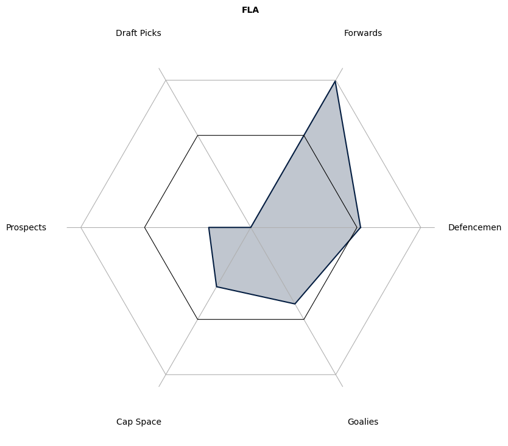
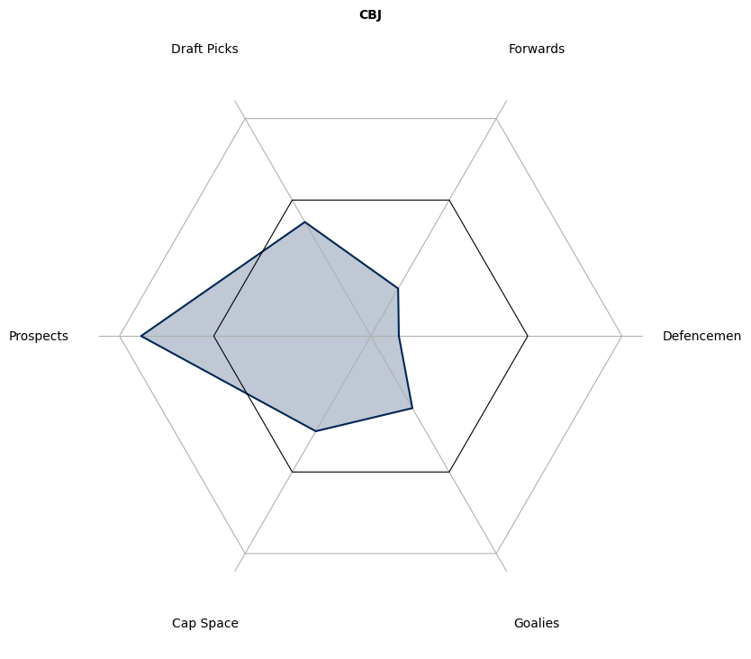
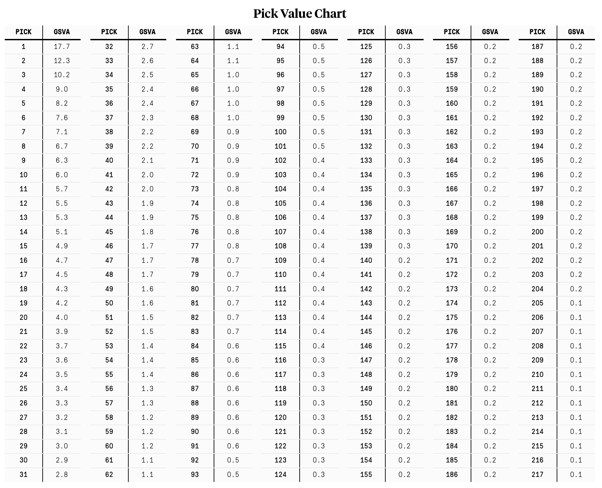

# Organization Value Charts

The genesis of this idea came from a quote by Jeff Marek, which I sadly don't remember exactly, where he discussed how assets either exist in the realm of "actuality" or "potentiality". I immediately wanted to assess NHL clubs in this way, and this is the outcome of that work!

I hope these visuals provide an interesting view into how each club is currently aligned. Rebuilding will have many assets in the futures categories with little value found on the NHL roster. Meanwhile, contenders will have shifted their assets towards the present, sacrificing the future to help them win now.

You can also get a sense of how well organizations are run, at least according to the limited metrics I have used. Some teams grade out ahead of average in nearly every category, meaning that they are likely poised for success now and in the future. On the other hand, there are teams which find themselves below average across the board, likely signalling poor asset management along the way.

## Date of Data Collection

The data presented was gathered at the beginning of the 2022-2023 NHL season. Future revisions to the charts with up-to-date data are planned. Trades since the beginning of the 2022-2023 season are NOT reflected in the charts.

## Method

I decided to evaluate teams in six categories:
* Forwards on NHL Roster
* Defenceman on NHL Roster
* Goalies on NHL Roster
* Draft Picks
* Prospects
* Salary Cap Commitments

The first three describe the current state of a team. The more value they possess in these categories, the more likely they are to be successful in the present or near future. 

The last three categories reflect the assets a team posseses to improve in the future. Prospects and draft picks can be projected to provide value to the team in future seasons, more is better. Salary cap commitments hinder a team's ability to improve in the future. While there are benefits to having players under contract, the value they bring to the organization is already reflected in the Forward/Defenceman/Goalie categories. Teams cannot freely add players with present value to their roster as they are limited by the amount of salary cap space they possess. Therefore, fewer salary cap commitments provides more opportunity for a team to improve. 

## Charts

You can find each team's chart below. I decided to present the data as a spider chart, as the total size of the shaded area can be used to approximate total value. The larger the area, the better.

Metrics representing future opportunity are on the left, and present value is on the right. The chart for a rebuilding team should skew to the left while a contender should skew to the right.

Each category is normalized so that the black line represents league average. The outer bound represents the best in the league while the center represents the worst.

### Atlantic

### Metropolitan

### Central

### Pacific

## Appendix: The Data

If you've made it this far, thank you for your interest in the project! In this section I will describe how I sourced and processed the data. This project is very much still in it's early stages, and I already have thoughts on how to make it better. That being said, I would love to hear your feedback on any aspect of the project! You can find me on twitter [@DeclanJohnston_](https://twitter.com/DeclanJohnston_).

### Data Sources

The data used in this project was sourced from many locations. I want to thank all of these people, as well as anyone who publishes this data for us all to use. Specifically I would like to thank:

* [CapFriendly](https://www.capfriendly.com/) - [@CapFriendly](https://twitter.com/CapFriendly) on Twitter. I used their website to source all contract data and determine draft pick ownership.
* Dom Luszczyszyn - [@domluszczyszyn](https://twitter.com/domluszczyszyn) on Twitter. I used [this article](https://theathletic.com/1798463/2020/06/12/by-the-numbers-revisiting-the-true-value-of-a-draft-pick/) to determine draft pick value. I also used [this series of articles](https://theathletic.com/3608075/2022/10/05/nhl-team-previews-projections-rankings/) to determine the present value of every player currently in the NHL.
* Scott Wheeler - [@scottcwheeler](https://twitter.com/scottcwheeler) on Twitter. I used [this article](https://theathletic.com/3923067/2023/01/09/nhl-prospect-rankings-2023/) to rank prospect pools.
* Logan Horn - [@LoganWHorn](https://twitter.com/LoganWHorn) on Twitter. I used [this article](https://thehockeywriters.com/nhl-farm-system-rankings/) to rank prospect pools.
* [Byron Bader](https://hockeyprospecting.com/) - [@ByronMBader](https://twitter.com/ByronMBader) on Twitter. I used his [Team Prospect Strength Tool](https://hockeyprospecting.com/hockey-prospecting-tools/1193-2/) to rank prospect pools.

### Overall Strategy

My goal was to create six quantitative metrics to describe an organization's assets. The methods of measurements across the categories were drastically different in every way, from the source to the scale and the distribution of the data. Ultimately I wanted to be able to plot them together, so I needed to normalize the data. 

I performed this normalization in two stages. First, I took the raw metric and tabulated the mean and standard deviation across all NHL teams. This allowed me to convert each raw metric into a Z-score. This transformation normalizes across different scales. Another benefit is that each category has a 0 average, an easy baseline to conpare with. 

At first I believed this was the only normalization that was needed, however the resulting charts were difficult to read. The distribution of the Z-scores were not uniform across different categories, for example draft picks have absolute maximum Z-score of ~3 while cap space had an absolute maximum Z-score of ~1.5. This meant that it was difficult to compare cap space scores between teams on the charts, they were all physically clustered because the unit along the axis was Z-score. 

So I needed one more step of normalization, normalizing across the axes. I did this by taking each Z-score and dividing it by the absolute maximum Z-score in that category. This meant that each category had one entry with an absolute value of 1 and all data falls into the range [-1, 1], with an average of 0. In other words, I linearly mapped each axis onto the range [-1, 1].

Now, when plotted together, the outer ring and chart center can be interpreted as being the extreme (best/worst) value across the league for each category. It is clear when a team truly excels or falls short in each metric. If a datapoint nearly reaches the outer ring, that team is among the league leaders in that asset class. Similarly, when the data approaches the center you can conlude that the team is among the league worst in that category.

### NHL Roster Value

I divided the present value of the NHL roster into three categories: forwards, defencemen, and goalies. The raw metric used is cumulative game score value added ([GSVA](https://theathletic.com/1019070/2019/06/14/improving-our-nhl-projection-model-ahead-of-the-2019-20-season/)) for all players in a lineup: 12 for forwards, 6 for defencemen, 2 for goalies. Note that the rosters and values used are from pre-season 2022-23 with injured (non-LTIRetired) players included.

In future iterations, I would like to incorporate multiple models and keep an up-to-date picture of the rosters. This requires automated data-gathering to be feasible. 

### Draft Picks

The raw metric used for draft pick capital is the net GSVA for a team's surplus or deficit of draft picks.

Draft pick value was assigned based on this table sourced from [this article](https://theathletic.com/1798463/2020/06/12/by-the-numbers-revisiting-the-true-value-of-a-draft-pick/):

Since the slot of a draft pick is not determined until after the season I decided to treat every ith round pick as equivalent. I found the average value for a pick in each round and added/subtracted the appropriate value for every pick a team had in surplus or deficit. This means that a team that has traded no future draft picks has a net value of 0. Teams that have accumulated future picks have a positive value, while teams who have traded away picks have negative value.

For example, when the data was collected (Nov 28th, 2023) the Dallas Stars had a net deficit of one 1st round pick, one 3rd round pick, and two 4th round picks. That left them with a deficit of -7.22 GSVA in draft pick capital. 

### Cap Space

The raw metric I used to evaluate cap space is total cap commitments in 2023-24 and onwards. When calculating Z-scores, I multiplied by -1 so that having less salary committed resulted in a higher score.

### Prospects

The raw metric I used to evaluate prospects was the average ranking for a team's prospect pool across three sources. The sources used were Hockey Prospecting, Scott Wheeler's 2023 prospect pool rankings, and Logan Horn's farm system rankings. 

One obvious question is why didn't I just linearly map these rankings directly onto a [-1, 1] scale? I chose to first fit them to a normal distribution because I felt as though the value contained within farm system's does not vary linearly down the list. However this choice was subjective, and I am curious to hear other opinions on how to handle this category!
